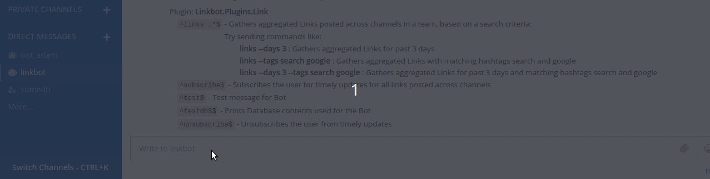
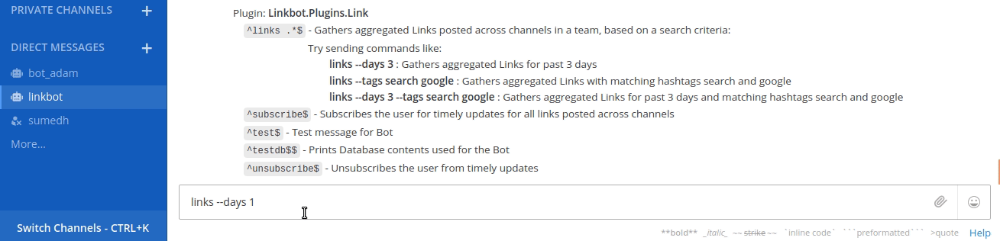
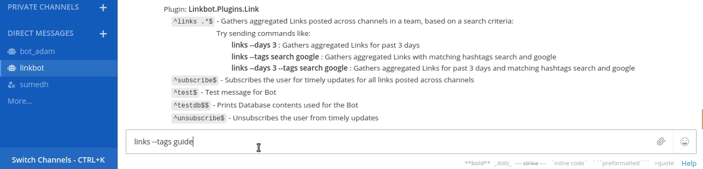
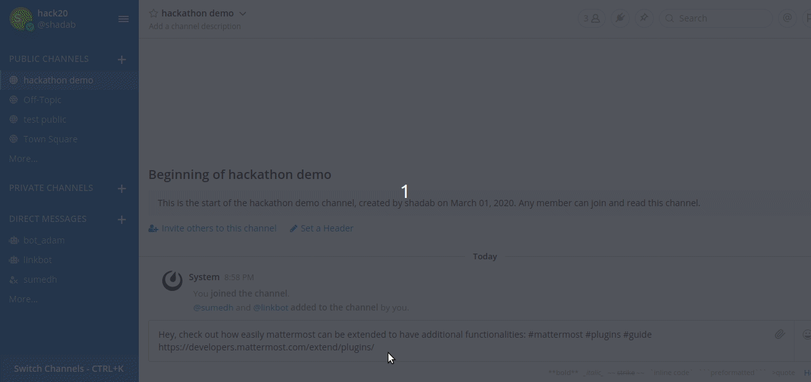
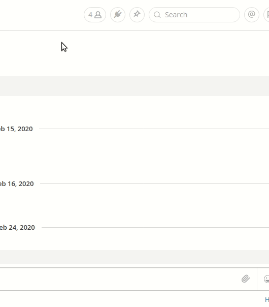

# Linkbot

## Summary

* Linkbot aims to improve user workflow by organizing the links shared on Mattermost groups.
* This would enhance user experience, encourage knowledge sharing and increase productivity. 
* Linkbot silently listens to links posted on channels (it is a part of) and provides a unified view for quick access.
* Supports searching links for a specific time period and/or search via tags.
* Supports scheduling periodic aggregation of links (weekly/monthly) posted across channels in a team. 
* With additional [linkbot-plugin](https://github.com/shadabk96/mattermost-linkbot-plugin), linkbot provides a clean UI to access the knowledge shared.

## Features

* Based on Mattermost [API(V4.0.0)](https://api.mattermost.com)
* Messages can be handled concurrently
* Automatically reconnect to Mattermost when connection is lost
* Python3 Support
* Commands based bot utility
* Commands with their usage visible on bot
* Supports Link aggregation across channels in a team
* Supports Link search with filtering based on time period and hashtags
* Support for subscribing to periodic updates of links (daily/weekly/monthly)
* Support for unsubcribing to periodic link updates
* On bot start, support for auto updates of link aggregation for an already subscribed user
* Support for displaying link aggregation results with formatting and markdown

## Setup

* Clone this repository.
* Run `pip install -r requirements.txt` to install all required dependencies.
* Edit .env file in cloned directory (optional)
```
DATABASE_FILENAME=sqlite.db
```
* Create a new bot account from system console.
* Open settings.py and edit following parameters. Bot token can be fetched from system console. ([Help](https://docs.mattermost.com/developer/bot-accounts.html))
```
MATTERMOST_API_VERSION = 4
BOT_URL = 'http://localhost:8065/api/v4'
BOT_TOKEN = ""
BOT_TEAM = ''
SSL_VERIFY = False
```

## Run the bot

* Run the cli.py file by typing `python cli.py`
* Open mattermost instance and send a personal message 'test' to the bot. The bot should reply "Hello" with your username.

## Demo

* Test message


* Search using --days option


* Search using --tags option


* Linkbot entries reflected in [UI plugin](https://github.com/shadabk96/mattermost-linkbot-plugin)


* Populated sidebar UI plugin  


* Subscribe and unsubscribe demo


## Coming soon
Due to the time constraints of the hackathon, we were not able to complete every functionality as planned. The development of this project is going on and more features will be added soon. 
* Auto generation of tags 
* Natural language search queries
* Personalized feed for user based on his channels and interests
* More options to subscribe. Eg: '--daily' '--weekly'
* Search options in UI Plugin
* Extending linkbot to files and images shared in the channel

## Authors

* Shadab Khan - [Github](https://github.com/shadabk96) | [LinkedIn](https://www.linkedin.com/in/shadabk96/)
* Sumedh Kale - [Github](https://github.com/sumedhkale) | [LinkedIn](https://www.linkedin.com/in/sumedh-kale/)

---

Special thanks to [mmpy_bot](https://github.com/attzonko/mmpy_bot)
